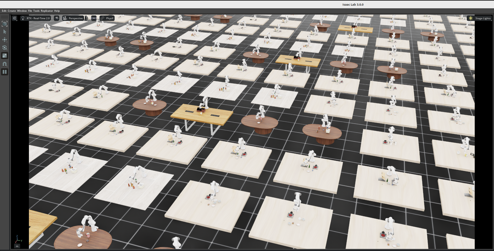

# Hebero

<p align="center">
  <a href="https://github.com/hebero-rl/Hebero"></a>
  <a href="https://huggingface.co/datasets/hebero/Hebero-Dataset"></a>
  <a href="https://hebero-rl.github.io/"></a>
  <a href="https://github.com/isaac-sim/IsaacLab"></a>
  <a href="https://developer.nvidia.com/isaac/sim"></a>
  <a href="https://github.com/leggedrobotics/rsl_rl"></a>
</p>

<p align="center"></p>

**Hebero** runs the 40 tasks from the LIBERO Long, Object, Spatial and Goal suites with a shared multitask policy in Isaac Lab.
**DGPO** is the demonstration-guided training framework. **IW-ABC** is the state-based algorithm combining task importance weighting and adaptive behavior cloning; **Vis IW-ABC** is its vision variant.

## Setup

Clone the repository:

```bash
git clone https://github.com/hebero-rl/Hebero.git
cd Hebero
```

Run the commands below from the repository root on Linux with an NVIDIA GPU, a working NVIDIA driver, and `uv` installed. Allow at least 40 GB for the environment and package cache. Use Python 3.12.12 and the pinned Isaac Sim / Isaac Lab dependencies:

```bash
uv venv .venv --python 3.12.12
source .venv/bin/activate
uv pip install --no-deps --index-strategy unsafe-best-match --prerelease allow \
  --extra-index-url https://pypi.nvidia.com \
  --extra-index-url https://download.pytorch.org/whl/cu128 \
  -r docker/requirements.txt

# Match docker/Dockerfile: install the CUDA 12 libraries last because the
# frozen environment also contains CUDA 13 packages with overlapping files.
uv pip install --reinstall --no-deps \
  --extra-index-url https://pypi.nvidia.com \
  nvidia-nccl-cu12==2.27.5 nvidia-cudnn-cu12==9.10.2.21 \
  nvidia-cusparselt-cu12==0.7.1 nvidia-nvshmem-cu12==3.4.5

export OMNI_KIT_ACCEPT_EULA=YES
```

The frozen environment is installed with `--no-deps` because some upstream package metadata constraints differ from the pinned reference versions.
Download the LIBERO USD assets and assembled demonstrations from the public, ungated [Hugging Face dataset repository](https://huggingface.co/datasets/hebero/Hebero-Dataset) (about 440 MiB; no login needed):

```bash
hf download hebero/Hebero-Dataset --repo-type dataset \
  --revision 8a84c4eafd3d33a8f414a1c278ad702ad13d4436 \
  --local-dir datasets
```

This creates `datasets/USD/` and `datasets/demos/` (40 task files, 50 demonstrations per task). Override `LIBERO_ASSETS_DATA_DIR` and `LIBERO_ASSEMBLED_DATASET_DIR` to use another location.
The first simulator launch also downloads NVIDIA robot and ground-plane assets, so keep network access available.

Use **`train.sh` and `eval.sh`** as the entry points. They load `libero_common.sh`, select the PhysX preset, and call `run.sh` internally to expose the vendored packages under `source/`. Docker setup is also available through `docker/build.sh` and `docker/launch.sh`.

## Quick start: single-GPU IW-ABC

After setup and data download, run all 40 state-based tasks with one environment per task for **10 training iterations**:

```bash
source .venv/bin/activate
export OMNI_KIT_ACCEPT_EULA=YES

CUDA_VISIBLE_DEVICES=0 DISTRIBUTED=0 LIBERO_NUM_ENVS=40 \
MAX_ITERATIONS=10 AGENT=rsl_rl_iw_abc_cfg_entry_point \
VIZ_ARGS="--viz none" ./train.sh libero \
  agent.algorithm.iw_sr_shape=sigmoid \
  agent.algorithm.bc_sr_shape=beta \
  agent.algorithm.bc_beta_concentration=2.0 \
  agent.algorithm.anneal_steps=200000
```

`DISTRIBUTED=0` selects a single process/GPU; `VIZ_ARGS="--viz none"` runs without a viewer. The launcher prints `40 envs / 40 tasks = 1 envs per task`. A successful run prints iterations `0/10` through `9/10` and saves checkpoints and TensorBoard logs under `logs/rsl_rl/libero_all_iw_abc/<timestamp>/`. The first launch includes asset loading and physics initialization before iteration 0.

Verified on Ubuntu 22.04 with an NVIDIA RTX 5880 Ada (48 GB), driver 580.178.04, Python 3.12.12, and the pinned dependencies above. Training took about 17 seconds after environment initialization; first-time setup and initialization take longer.

## Tasks and methods

Task IDs describe the suite and observation type, independently of the learner:

| Task | Purpose |
| --- | --- |
| `Isaac-Hebero-All-State-v0` | State training, 40 tasks |
| `Isaac-Hebero-All-Vision-v0` | Vision training, 40 tasks |
| `Isaac-Hebero-All-State-Play-v0` | State evaluation |
| `Isaac-Hebero-All-Vision-Play-v0` | Vision evaluation |

Replace `All` with `Long` for single-suite training. State evaluation also supports `Object`, `Spatial`, `Goal`, `Spatial-Goal` and `Object-Long`. Use an environment count divisible by the number of tasks.

These names replace `Isaac-Libero-<suite>-Dgpo-Osc[-Vision][-Play]-v0`. The task configuration and training parameters are preserved. `rsl_rl_iw_abc_cfg_entry_point` selects IW-ABC or Vis IW-ABC according to the task. The old `rsl_rl_dgpo_cfg_entry_point` remains an alias; the legacy state `rsl_rl_abc_cfg_entry_point` also selects the full IW-ABC configuration.

## Train and evaluate

Standard IW-ABC training: 8 GPUs, 2,000 environments per GPU.

```bash
DISTRIBUTED=1 NPROC_PER_NODE=8 LIBERO_NUM_ENVS=2000 \
MAX_ITERATIONS=30000 AGENT=rsl_rl_iw_abc_cfg_entry_point \
./train.sh libero \
  agent.algorithm.iw_sr_shape=sigmoid \
  agent.algorithm.bc_sr_shape=beta \
  agent.algorithm.bc_beta_concentration=2.0 \
  agent.algorithm.anneal_steps=200000
```

For **Vis IW-ABC**, add `LIBERO_TASK=Isaac-Hebero-All-Vision-v0`; `train.sh` enables cameras automatically. Set `CAMERA_HEIGHT=224 CAMERA_WIDTH=224` for the camera resolution reported in the accompanying paper. The frozen Theia encoder must already be available in the local model cache for offline execution. New runs use `libero_all_iw_abc` and `libero_all_vis_iw_abc` log directories.

Evaluate an rsl-rl 5 checkpoint produced by this package:

```bash
CUDA_VISIBLE_DEVICES=0 LIBERO_NUM_ENVS=40 \
LIBERO_CKPT=/path/to/model.pt MAX_EPISODES_PER_TASK_LIBERO=50 \
./eval.sh libero
```

`eval.sh` runs without a viewer by default. For vision evaluation, add `LIBERO_TASK=Isaac-Hebero-All-Vision-Play-v0`; the script enables cameras automatically. Evaluation writes per-task success rates next to the checkpoint.

## PPO references

Select these configurations with `AGENT=<entry_point> ./train.sh libero` and append the additional arguments below. The shared PPO configuration enables IW by default.

| Paper method | Agent entry point | Additional arguments |
| --- | --- | --- |
| PPO | `rsl_rl_mtppo_cfg_entry_point` | `agent.algorithm.use_importance_weights=False` |
| BC → PPO | `rsl_rl_mtppo_cfg_entry_point` | `agent.algorithm.use_importance_weights=False --init_from_checkpoint /path/to/bc.pt` |
| ABC | `rsl_rl_iw_abc_cfg_entry_point` | `agent.algorithm.use_importance_weights=False` |
| IW-PPO | `rsl_rl_mtppo_cfg_entry_point` | IW is already enabled |
| IW-DAPG | `rsl_rl_dapg_cfg_entry_point` | `agent.algorithm.use_importance_weights=True` |
| IW-ABC / Vis IW-ABC | `rsl_rl_iw_abc_cfg_entry_point` | State / vision task as above |
| RFCL (PPO-based) | `rsl_rl_ppo_rfcl_cfg_entry_point` | `agent.algorithm.use_importance_weights=False` |
| IW-RFCL (PPO-based) | `rsl_rl_ppo_rfcl_cfg_entry_point` | IW is already enabled |


Runner configurations: [rsl_rl_ppo_cfg.py](source/isaaclab_contrib/isaaclab_contrib/tasks/manipulation/libero/config/franka/agents/rsl_rl_ppo_cfg.py). Shared PPO implementation: [dgpo_ppo.py](source/isaaclab_rl/isaaclab_rl/rsl_rl/dgpo_ppo.py).
